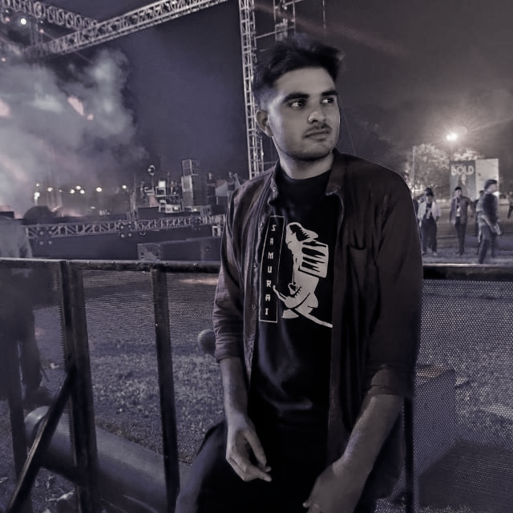

I am a pre-final year B.Tech undergrad at the Indian Institute Of Technology, Roorkee. My interests include self-supervised learning, generative modeling, computer vision, and natural language processing. 

Currently, I have been working with Bosch as a computer vision research intern on improving the quality of segmentation datasets through self-supervised learning techniques. Last Summer, I undertook an internship with SkyLark labs where I worked on the implementation of super-resolution GANs for night to day video conversion and further worked on reducing the memory footprint of the model using depthwise separable ConvNets, model distillation, and involution layers. Previously I have worked on conversational AI chatbots, conditional GANs, flood predictions, semantic segmentation, time-series predictions, and recommender systems. 

I am a senior member of the Vision and Language Group on campus, which holds weekly discussions to get acquainted with recent advances in Deep Learning and discuss research papers. I am also a core team member of Data Science Group, IITR where we collaborate to undertake application-based deep learning projects.